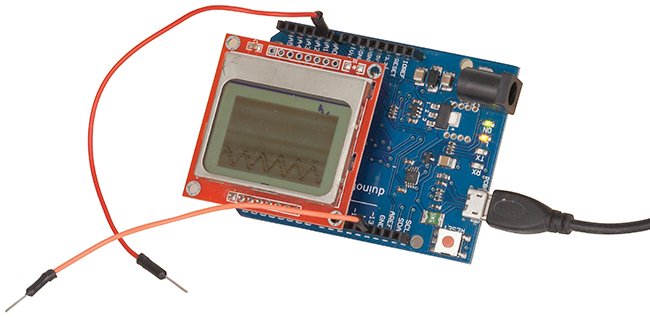
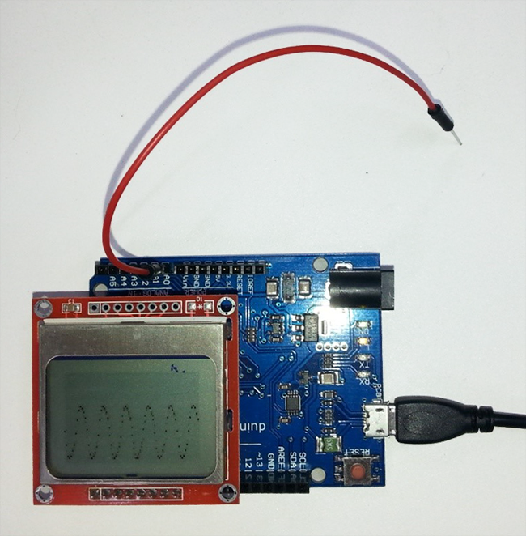

# Simple Duinotech Oscilloscope

This little test tool is designed to be easily put together if you need a very basic 'scope in a hurry. There's no high end specs here- the maximum sample rate is about 700 samples per second, and it's limited to the 0-5V that the Arduino analog pins can handle. Still, it's sensitive enough to pick up the 50Hz noise from mains wiring without making contact. Also includes a tone generator, so you can compare signal frequencies too.

## Shopping list:

|Qty| Code | Description |
|---|---|---|
|1 | [XC4430](http://jaycar.com.au/p/XC4430) | Duinotech Leonardo Board
|1 | [XC4616](http://jaycar.com.au/p/XC4616) | 84x48 dot matrix nokia display
|1 | [WC6024](http://jaycar.com.au/p/WC6024) | plug-plug jumper leads

## Connections:

|Leonardo|Display|Jumper Wire|Function
|---|---|---|---
|D0|VCC||Power
|D1|GND||Ground
|D2|SCE||Chip Select
|D3|RST||Reset
|D4|D/C||Data/Command Select
|D5|DN(MOSI)||Serial Data from Leonardo
|D6|SCLK||Serial Clock from Leonardo
|D7|LED||LED power
|A0||One end|Scope input
|D13|||Output for tone generator

You'll notice that the connection between the Leonardo and display is achieved by simply plugging the Display header into D0-D7 on the Leonardo. One end of a jumper can be plugged into A0 (the other end is your probe). There is only one probe, as the signal is referenced to the Arduino's ground- you could add a return probe here, just be careful that what you're connecting to doesn't have another connection back to the Leonardo board. You can use the tone generator output by plugging the other end of your probe into D13.

## Code:

The code is designed to be fast and simple, to achieve a high sample rate- the analog input is read, converted to a pixel value, then the display automatically moves a column to the right (so the scanning happens automatically). There are no libraries needing to be installed, as all the necessary functions are built into the code. The construction can be simplified to the simple plug-in arrangement because the display uses very little power, and even a digital output can provide enough power to run it. We're using a Leonardo because an Uno would need D0 and D1 for uploading the sketch, and having something plugged in would interfere with uploading. You could use an Uno, just don't have the screen plugged in while you're uploading.

## Use:

Here we can see the probe picking up '50Hz hum' from the surroundings. It looks like a lot, but even a very high value resistor would dissipate it and make the value much lower. The scope could be used to quickly visualise whether a signal is present in another project, or even to see if it is at the right voltage levels (there's no scale, but the bottom is 0V and the top is 5V).

## Improvements:

There's some notes inline in the sketch as to how it can be upgraded- for example the tone frequency can be changed by changing the definition of `TONE_FREQ`. Gridlines can be added by changing the initial declaration of the `dispdata` array. The actual sample rate can be changed by changing the delay at the end of the loop function- this can be handy if you're trying to lock onto a certain frequency. If you're changing some of these settings frequently, perhaps they could be tied to an analog input attached to a potentiometer. The sample rate cannot be easily increased without totally rewriting the code, but is not impossible. Other scope features such as triggering or different vertical scales are certainly possible, but would require more input devices to set these values, which would take away from the simplicity.
